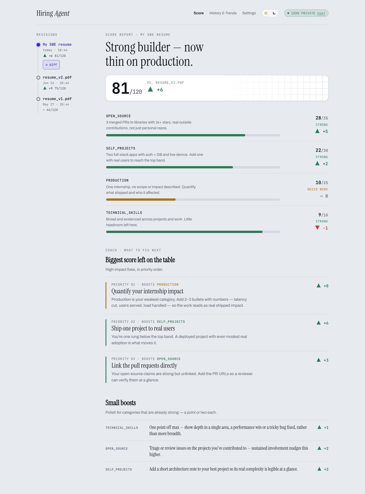
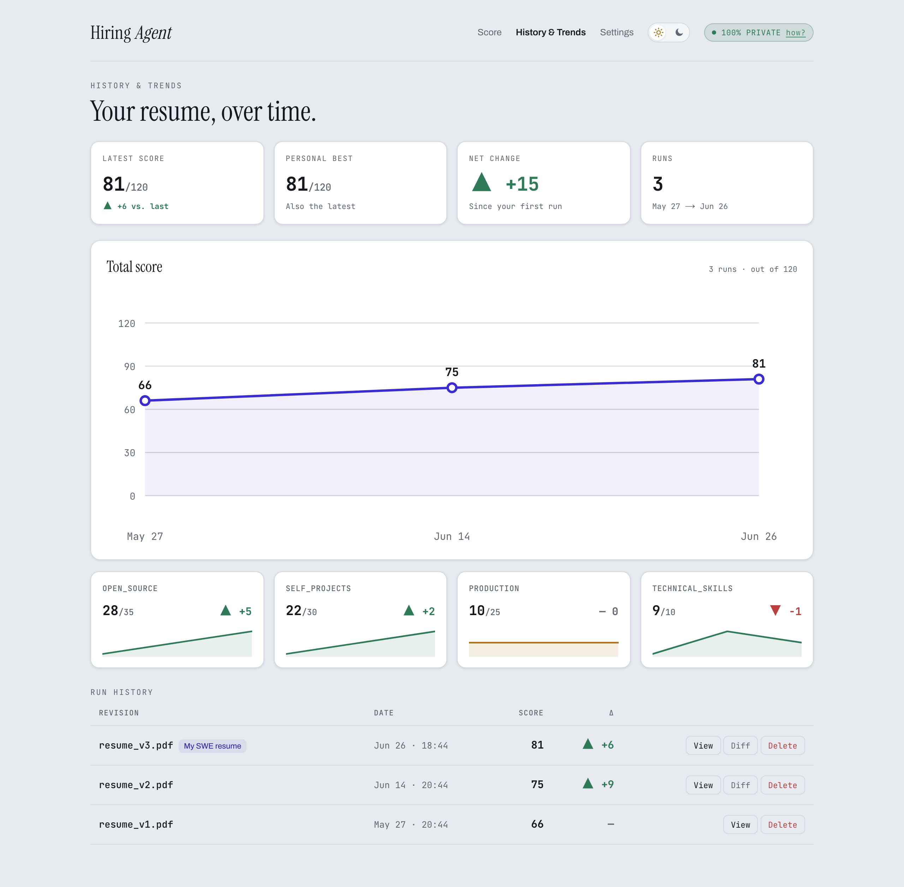
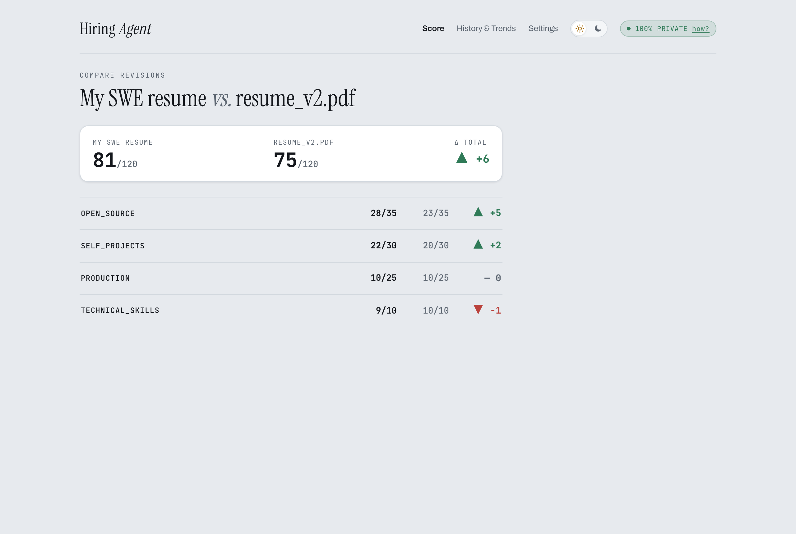
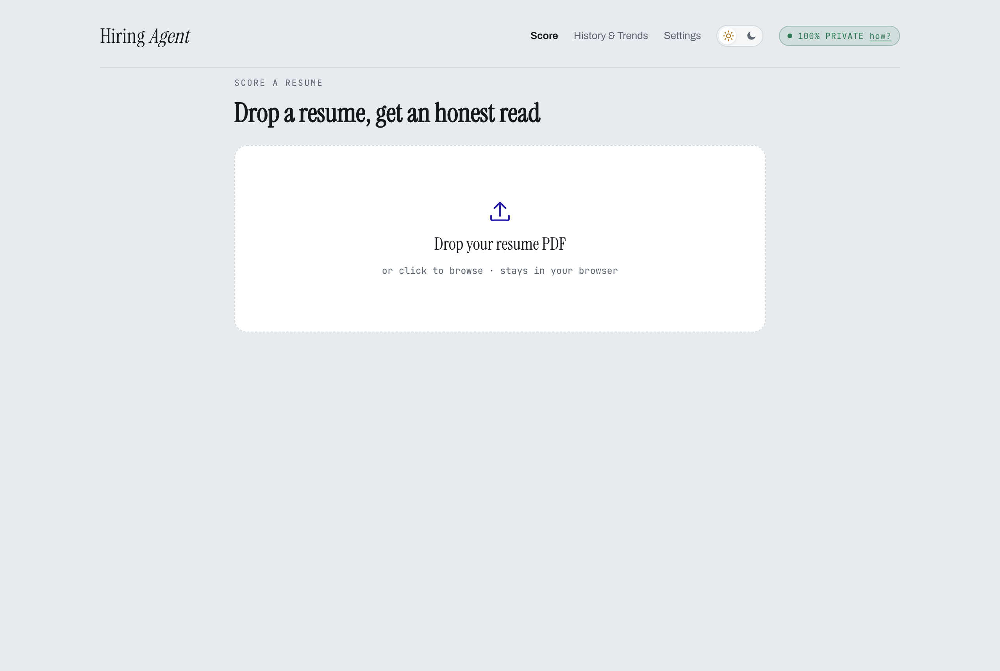
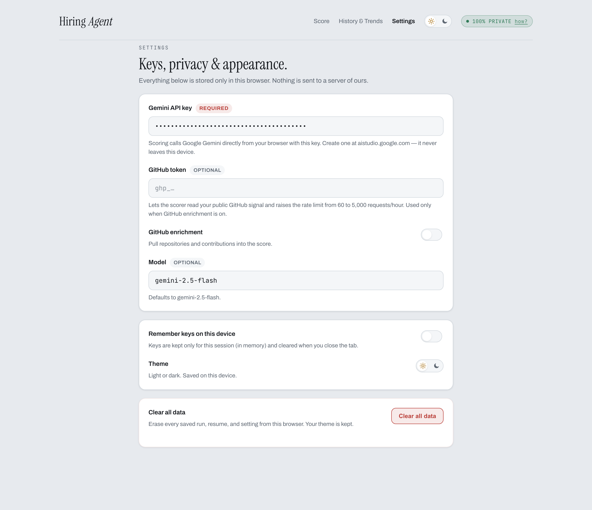
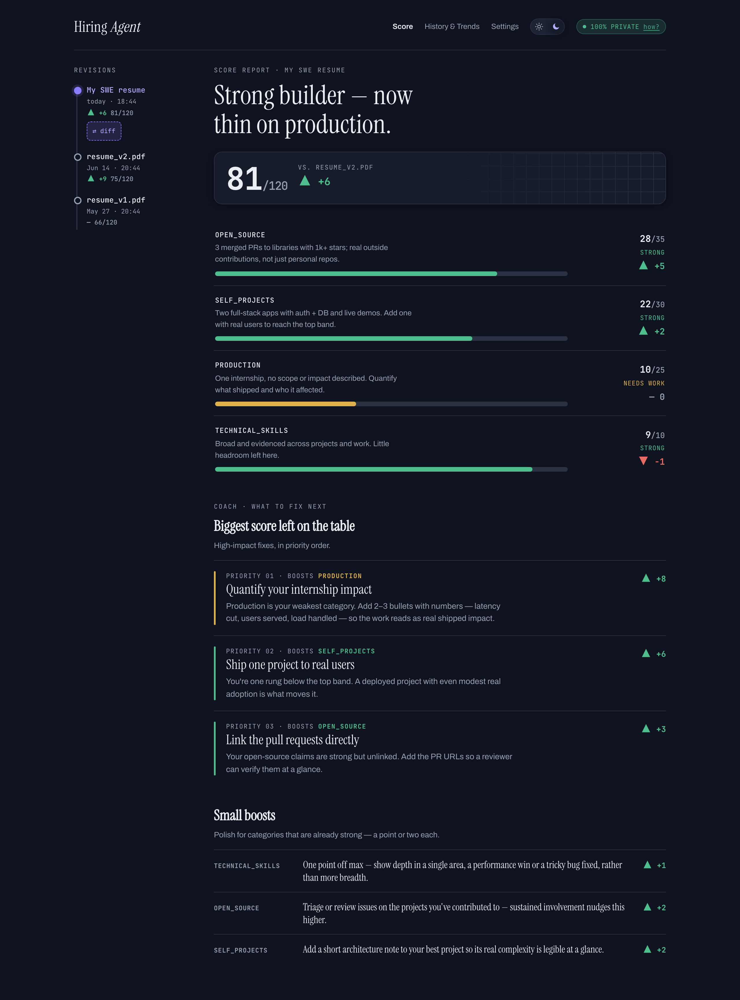

# Fix My Resume

<p align="center"><strong>A privacy-first, in-browser resume scorer.</strong><br>
Upload a resume PDF and get an explainable, fairness-constrained score, a plain-language coach, and trend tracking over time — running entirely in your browser.</p>

<p align="center">
  <a href="https://hiring-agent-web.vercel.app"></a>
  <a href="./LICENSE"></a>
  
  
</p>

> **🔗 Try it now: https://hiring-agent-web.vercel.app** — no install, no sign-up. Bring your own Google Gemini API key.
>
> 🔒 Your resume and your API key never leave your browser — there's no backend of ours for them to pass through.

---

<p align="center">
  
</p>

## Why this exists

Most resume scorers ask you to upload your career history to their servers, or they're command-line tools you have to install and babysit. **Fix My Resume** is neither — a polished web app anyone can open and use that runs the whole pipeline **in your browser**: it parses your PDF, produces an explainable score, coaches you on what to fix, and charts your progress over time. Visual trends, a conversational coach, and run-to-run comparison, with privacy built into the architecture rather than promised in a policy.

The guiding constraint is **privacy by architecture**. The app is a **static site with no backend of ours**. Your PDF is parsed in the browser; scoring goes **straight from your browser to Google Gemini using a key you supply**. Your resume, your key, and your entire history never touch a server we control — there's nothing to leak, log, or breach.

---

## What it does, and why it helps

### 🔒 100% private — by design, not by promise
Everything runs client-side. PDF text extraction happens locally (via `pdf.js`); the only network call is from **your** browser to **your** Gemini key. Run history is stored in your browser's **IndexedDB**, settings in `localStorage`. There is no account, no tracking, and **"Clear all data"** wipes everything instantly.
**Why it matters:** a resume is sensitive. This is the rare scoring tool you can use without handing your career history (or an API key) to a third party.

### 📊 An explainable, fairness-constrained score
Each run produces a **/120 score across four weighted categories** — Open Source (35), Self-Projects (30), Production (25), Technical Skills (10) — plus bonus points and deductions. **Every category shows the evidence behind its number.**
**Why it matters:** you don't just get a grade, you get the *reasoning* — and the rubric is explicitly **blind to name, gender, school, GPA, and location**, so the score reflects the work, not the person.

### 🧭 A plain-language resume coach
A dedicated pass turns the score into action: **"Biggest score left on the table"** lists the highest-impact fixes in priority order (each tagged with the category it boosts and an estimated point gain), followed by **"Small boosts"** for categories that are already strong.
**Why it matters:** most tools tell you *what* you scored; this tells you *what to do next* and roughly how much each change is worth.

### 📈 Trend tracking — watch your resume improve
Re-score an improved resume and the app charts your **total over time**, draws **per-category sparklines**, and summarizes **latest / personal best / net change** at a glance.
**Why it matters:** iterating on a resume is usually guesswork. Here it's measurable — you can see whether an edit actually moved the needle.

### 🔀 Run-to-run diff
Pick any two runs and see the **category-by-category delta** (`▲ +5` / `▼ -1`). A commit-log-style "revision rail" tracks every past version of your resume.
**Why it matters:** it turns resume editing into something like version control — concrete deltas instead of vague impressions.

### 🐙 Optional GitHub enrichment
Add a GitHub token and the scorer factors in your **public contributions** — merged PRs, open-source vs. personal repos, project quality — and the token raises the GitHub API limit from 60 to 5,000 requests/hour.
**Why it matters:** for engineers, real code is the strongest signal. This grounds the score in what you've actually shipped.

### 🎨 Considered, accessible design
Light and dark themes, a typographic "human document measured by a precise machine" aesthetic, keyboard-navigable, screen-reader-friendly (live-region progress, `aria-current` nav), and `prefers-reduced-motion` aware.

---

## Choosing a Gemini model

You bring your own Gemini key, so **you choose the model** from the dropdown in **Settings → *Model*** (it defaults to Flash). A run makes **2 Gemini calls** — scoring → coaching — plus a third **extraction** call only when GitHub enrichment is enabled. All use structured JSON output, which every model below supports.

| Model | Best for in this app | Speed | Relative cost | Why pick it |
|---|---|:---:|:---:|---|
| **`gemini-2.5-pro`** | The most accurate scoring & richest coaching | 🐢 Slower | $$$ | Strongest reasoning. Choose it when you want the most careful, defensible evaluation and the most insightful coach notes — e.g. a final pass before applying. |
| **`gemini-2.5-flash`** ⭐ *default* | Everyday use — the balanced choice | ⚡ Fast | $$ | Near-Pro quality on this structured task at a fraction of the latency and cost. The right pick for almost everyone. |
| **`gemini-2.5-flash-lite`** | Fast, high-volume, or cost-sensitive runs | ⚡⚡ Fastest | $ | Cheapest and snappiest — great while you're rapidly editing and re-scoring. Coaching nuance is a touch lighter than Flash/Pro. |
| **`gemini-2.0-flash`** | Fallback / older keys | ⚡ Fast | $ | Previous generation. Use it if your key doesn't yet have access to the 2.5 family. |

**Rule of thumb:** start with **Flash** (the default). Switch to **Pro** when you want the most trustworthy score and the deepest feedback; drop to **Flash-Lite** when you're iterating fast or watching cost. Pick whichever fits from the **Settings → *Model*** dropdown.

> **A note on scores:** scores are **indicative**. Fix My Resume runs its scoring pipeline in TypeScript with a single combined extraction step, so a number here may differ from a reference run. Use it for relative guidance and trend tracking, not as an absolute hiring signal.

---

## Screenshots

| History & Trends | Compare revisions |
|---|---|
|  |  |

| Score (upload) | Settings | Dark mode |
|---|---|---|
|  |  |  |

---

## Quick start

**Just use it:** open **https://hiring-agent-web.vercel.app**, go to **Settings**, paste your [Gemini API key](https://aistudio.google.com/apikey), then drop a resume PDF on the **Score** screen.

**Run it locally:**

```bash
git clone https://github.com/1akashkalita/fix-my-resume.git
cd fix-my-resume/web
npm install
npm run dev          # http://localhost:3000
```

Full development, testing, and deployment docs are in **[`web/README.md`](web/README.md)**.

### How it works (per run, all in your browser)

1. **PDF → text** — `pdf.js` extracts selectable text locally.
2. **Scoring** — one Gemini call returns the fairness-constrained `/120` evaluation.
3. **Coaching** — a final Gemini call produces the prioritized fixes and boosts.
4. **GitHub enrichment** *(optional)* — when enabled, an extra Gemini call extracts your profile links, then your public repos are fetched and classified to enrich the score.

Results are saved to IndexedDB so trends and diffs can be computed across runs.

---

## Credits

The scoring methodology — the weighted category rubric and its fairness constraints — is adapted from the open-source [**Hiring Agent**](https://github.com/interviewstreet/hiring-agent) project and reimplemented in TypeScript for the browser. Everything else here — the web app, its UI, trends, coach, run-to-run diffs, and fully client-side architecture — is original to Fix My Resume.

---

## License

[MIT](./LICENSE).
