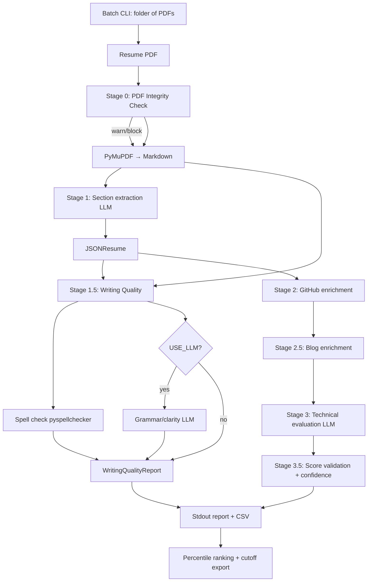

# Resume Scoring Enhancements — Implementation Plan

> **For agentic workers:** REQUIRED SUB-SKILL: Use superpowers:subagent-driven-development (recommended) or superpowers:executing-plans to implement this plan phase-by-phase. Steps use checkbox (`- [ ]`) syntax for tracking.

**Goal:** Harden and extend the resume scoring pipeline with five additive features — PDF integrity checks, deterministic score validation with confidence bands, writing quality review, blog/technical-writing enrichment, and batch percentile ranking — without changing the core 100-point rubric semantics.

**Problem today:**

| Gap | Impact |
|-----|--------|
| LLM-only score enforcement | Same resume scores 74–90 across runs; caps in `evaluator.py` are unused |
| CSV `total_score` omits bonus/deductions | Export disagrees with stdout display |
| Blog scoring stubbed | Prompts reference `=== BLOG DATA ===` but `score.py` never fetches blogs |
| Single-PDF CLI only | Original intent (rank 50k+ intern applications) has no batch/percentile tooling |
| No PDF hardening | Hidden/invisible text can inflate scores (community-reported attack) |
| Writing quality ignored | Typos/clarity not surfaced unless LLM mentions them in free text |

**Architecture:** Extend the existing pipeline in **six stages**. Stages 0, 1.5, and 3.5 are mostly deterministic (fast, reproducible). Blog fetch and optional writing LLM pass are gated by env flags. Batch ranking is a new CLI mode that reuses single-resume scoring.

**Tech stack:** Existing Python stack + `pyspellchecker` (spell check), `requests`/`httpx` (blog fetch), PyMuPDF (PDF integrity). No new LLM categories added to the rubric.

---

## Target Pipeline



---

## Implementation Phases

| Phase | Feature | Priority | New LLM calls | Files (primary) |
|-------|---------|----------|---------------|-----------------|
| **0** | PDF integrity check | P0 — security | 0 | `pdf_integrity.py`, `score.py` |
| **1** | Score validation + confidence | P0 — reliability | 0–2 (ensemble optional) | `score_validation.py`, `evaluator.py`, `transform.py`, `score.py` |
| **2** | Writing quality review | P1 — UX | 0–1 (optional) | `writing_quality.py`, `models.py`, `score.py` |
| **3** | Blog enrichment | P1 — signal | 0–1 (optional quality pass) | `blog.py`, `score.py`, `transform.py` |
| **4** | Batch ranking + cutoff | P1 — scale | 0 (reuses per-resume calls) | `batch_score.py`, `ranking.py`, `score.py` |
| **5** | Certificates/publications extraction | P2 — deferred | +2 LLM calls | `pdf.py`, new Jinja templates |

Implement phases **0 → 1 → 2 → 3 → 4** in order. Phase 5 is optional follow-up.

---

## Shared Design Principles

1. **Do not change rubric weights** — open_source (35), self_projects (30), production (25), technical_skills (10), bonus (≤20).
2. **Deterministic layers first** — enforce caps, compute confidence, spell-check, and PDF scans in Python, not prompts.
3. **Advisory vs. scored** — writing quality and PDF warnings are surfaced separately; only integrity *blocks* when configured.
4. **Backward-compatible CLI** — `python score.py resume.pdf` keeps working; batch mode is additive.
5. **Fix CSV/stdout parity** — one shared `compute_final_score()` used by print, CSV, and ranking.
6. **Feature flags in `config.py`** — every new stage can be disabled independently.

---

## Phase 0: PDF Integrity Check

**Goal:** Detect hidden/invisible text and suspicious PDF content before extraction or evaluation.

**Runs:** Stage 0 — before any LLM call.

### Detection heuristics (v1)

- Text rendered with white/near-white fill on white background
- Font size ≤ 1pt or opacity ≈ 0
- Text positioned far off-page (negative or > page bounds)
- Duplicate content: raw text length >> visible markdown length (ratio threshold)

### Output shape (`models.py`)

```python
class PdfIntegrityIssue(BaseModel):
    page: int
    issue_type: str  # "invisible_text" | "off_page_text" | "size_anomaly"
    snippet: str
    severity: str    # "warning" | "critical"

class PdfIntegrityReport(BaseModel):
    issues: List[PdfIntegrityIssue]
    raw_char_count: int
    visible_char_count: int
    passed: bool  # False if critical issues and BLOCK_ON_PDF_INTEGRITY_FAIL=true
```

### File changes

| Action | File | Purpose |
|--------|------|---------|
| Create | `pdf_integrity.py` | Scan PyMuPDF text spans for anomalies |
| Modify | `models.py` | Add `PdfIntegrityIssue`, `PdfIntegrityReport` |
| Modify | `config.py` | `ENABLE_PDF_INTEGRITY`, `BLOCK_ON_PDF_INTEGRITY_FAIL` (default `false`) |
| Modify | `score.py` | Run check after PDF path validation; print section; abort if blocked |
| Modify | `.env.example` | Document flags |

### Tasks

- [ ] **Task 0.1:** Implement `scan_pdf_integrity(pdf_path) -> PdfIntegrityReport` using PyMuPDF span metadata (color, size, bbox).
- [ ] **Task 0.2:** Add `print_pdf_integrity_report()` to `score.py`.
- [ ] **Task 0.3:** When `BLOCK_ON_PDF_INTEGRITY_FAIL=true` and critical issues found, exit before LLM calls with clear message.
- [ ] **Task 0.4:** Smoke test with a PDF containing white-on-white text (manual fixture in `test/fixtures/` if added).

---

## Phase 1: Score Validation + Confidence

**Goal:** Enforce rubric caps in code, unify final score computation, and expose score reliability.

**Problem references:**

- `evaluator.py` defines `MAX_BONUS_POINTS`, `MIN_FINAL_SCORE`, `MAX_FINAL_SCORE` but never uses them
- `print_evaluation_results()` caps in display only; raw `EvaluationData` unchanged
- `transform.py` `total_score` sums categories only — ignores bonus/deductions

### Core module: `score_validation.py`

```python
CATEGORY_MAX = {
    "open_source": 35,
    "self_projects": 30,
    "production": 25,
    "technical_skills": 10,
}

def normalize_evaluation(evaluation: EvaluationData) -> EvaluationData:
    """Cap category scores, bonus (≤20), deductions (≥0), final score ([-20, 120])."""

def compute_final_score(evaluation: EvaluationData) -> float:
    """Single source of truth for final score."""

class ValidatedEvaluation(BaseModel):
    evaluation: EvaluationData
    final_score: float
    adjustments: List[str]  # e.g. "open_source capped 38→35"
    confidence: Optional["ScoreConfidence"] = None

class ScoreConfidence(BaseModel):
    runs: int
    mean_score: float
    std_dev: float
    min_score: float
    max_score: float
    confidence_level: str  # "high" | "medium" | "low"
    unstable_categories: List[str]
```

### Confidence computation (v1)

- **Default (`ENSEMBLE_RUNS=1`):** Confidence derived from heuristic signals only:
  - High variance categories (historically noisy): `open_source`, `self_projects`
  - Flag `low` if evidence strings are empty/short or category score is at boundary (0 or max)
  - Flag `medium` if any cap/adjustment applied
- **Optional (`ENSEMBLE_RUNS=3`):** Run evaluation N times (same model, same input), compute mean ± std dev, flag categories with std dev > threshold.

Wire into `evaluator.py`:

```python
def evaluate_resume(self, resume_text: str, *, ensemble_runs: int = 1) -> ValidatedEvaluation:
    ...
    normalized = normalize_evaluation(raw)
    confidence = compute_confidence(raw_runs) if ensemble_runs > 1 else heuristic_confidence(normalized)
    return ValidatedEvaluation(...)
```

### Display (stdout)

```
🎯 OVERALL SCORE: 78.0/100  (final with bonus/deductions: 82.0)
📊 CONFIDENCE: 78 ± 6 (medium) — unstable: self_projects
⚙️  Adjustments: open_source capped 38→35; bonus capped 22→20
```

### CSV columns (add to `transform.py`)

- `final_score` — categories + bonus − deductions (capped)
- `score_std_dev`, `confidence_level`, `unstable_categories`, `score_adjustments`

### Tasks

- [ ] **Task 1.1:** Create `score_validation.py` with `normalize_evaluation()` and `compute_final_score()`.
- [ ] **Task 1.2:** Refactor `print_evaluation_results()` to use `ValidatedEvaluation` / shared compute.
- [ ] **Task 1.3:** Fix `transform_evaluation_response()` — replace raw category sum with `final_score`; keep category columns as-is.
- [ ] **Task 1.4:** Add ensemble support behind `ENSEMBLE_RUNS` env (default `1`).
- [ ] **Task 1.5:** Add `test_score_validation.py` with plain asserts for cap edge cases.
- [ ] **Task 1.6:** Document in README "Coverage" section that ensemble mode reduces variance at cost of N× eval latency.

---

## Phase 2: Writing Quality Review

**Goal:** Add spelling, grammar, and clarity feedback without changing the existing technical scoring rubric.

**Runs:** Stage 1.5 — after PDF extraction, before GitHub enrichment.

### Design principles (unchanged)

1. **Check raw PDF text, not extracted JSON** — catches typos before the LLM silently "fixes" them during section parsing.
2. **Do not affect the 100-point rubric** — writing issues are advisory, not scored categories.
3. **Minimize false positives** — allowlist tech terms + words from extracted skills/companies/projects.
4. **Optional LLM review** — grammar/clarity via local Ollama when `WRITING_QUALITY_USE_LLM=true`.
5. **Always re-read PDF for writing check** — even on resume cache hit (PyMuPDF only, no LLM cost).

### Output shape (`models.py`)

```python
class SpellingIssue(BaseModel):
    word: str
    suggestion: Optional[str]
    context: str  # line snippet

class WritingQualityReport(BaseModel):
    spelling_issues: List[SpellingIssue]
    grammar_issues: List[str]       # LLM only
    clarity_suggestions: List[str]  # LLM only
```

### Printed section

```
📝 WRITING QUALITY REVIEW
------------------------------------------------------------
Spelling (3 issues):
  1. "Experince" → "Experience"  (in: Software Experince at ...)
  2. ...

Grammar (LLM):
  1. Inconsistent past tense in work bullets 3–5

Clarity:
  1. Separate architectural decisions from implementation details
```

### File changes

| Action | File | Purpose |
|--------|------|---------|
| Create | `writing_quality.py` | Spell check + optional LLM review |
| Create | `prompts/templates/writing_quality.jinja` | LLM prompt for grammar/clarity |
| Modify | `models.py` | Add `SpellingIssue`, `WritingQualityReport`, `WritingQualityLLMResponse` |
| Modify | `config.py` | `ENABLE_WRITING_QUALITY`, `WRITING_QUALITY_USE_LLM` |
| Modify | `score.py` | Extract raw text, call review, print results |
| Modify | `transform.py` | Add writing columns to CSV export |
| Modify | `prompts/template_manager.py` | Register `writing_quality.jinja` |
| Modify | `requirements.txt` | Add `pyspellchecker` |
| Modify | `.env.example` | Document new env vars |
| Modify | `README.md` | Document Stage 1.5 |

### Tasks

- [ ] **Task 2.1:** Config flags in `config.py` + `.env.example`.
- [ ] **Task 2.2:** Data models in `models.py` (do **not** extend `EvaluationData`).
- [ ] **Task 2.3:** `check_spelling(text, resume_data)` in `writing_quality.py` — tokenize markdown, skip URLs/emails, merge static + dynamic allowlist, cap at ~20 issues.
- [ ] **Task 2.4:** Optional LLM pass via `writing_quality.jinja` — grammar/clarity only, truncate to ~12k chars, graceful fallback.
- [ ] **Task 2.5:** Integrate into `score.py` after extraction; `print_writing_quality_results()`.
- [ ] **Task 2.6:** CSV columns: `spelling_issue_count`, `spelling_issues`, `grammar_issues`, `clarity_suggestions`.
- [ ] **Task 2.7:** Smoke test — intentional typo appears; cache hit still spell-checks; no extra LLM when `USE_LLM=false`.

---

## Phase 3: Blog / Technical Writing Enrichment

**Goal:** Wire up the existing blog transform and prompt hooks so technical communication bonus points have real signal.

**Today:** `convert_blog_data_to_text()` and `_evaluate_resume(..., blog_data=...)` exist; `score.py` never passes `blog_data`.

### Discovery strategy (v1)

1. Collect candidate URLs from:
   - `resume_data.basics.url`
   - `profiles` where network matches blog platforms (Medium, Dev.to, Hashnode, Substack, personal domains)
   - GitHub profile `blog` field (already fetched in `github.py`)
2. Deduplicate URLs; fetch RSS/Atom or scrape `<title>`, `<published>`, word count, tech keywords (no full LLM for fetch).
3. Optional LLM pass (`ENABLE_BLOG_LLM_SCORING=true`): score each post 0–10 for technical depth; aggregate to `blog_score`.

### Output shape

Reuse existing dict contract expected by `convert_blog_data_to_text()`:

```python
{
    "total_blogs": 4,
    "blog_score": 7.5,
    "blog_details": "Regular posts on distributed systems; 2 posts in last 6 months",
    "blogs": [
        {"url": "...", "score": 8.0, "details": "Deep dive on Raft consensus"},
    ],
}
```

### File changes

| Action | File | Purpose |
|--------|------|---------|
| Create | `blog.py` | URL discovery, RSS/HTML fetch, optional LLM scoring |
| Create | `prompts/templates/blog_scoring.jinja` | Optional per-post quality prompt |
| Modify | `score.py` | Fetch blog data between GitHub and evaluation; cache as `cache/blogcache_*.json` |
| Modify | `config.py` | `ENABLE_BLOG_ENRICHMENT` (default `true`), `ENABLE_BLOG_LLM_SCORING` (default `false`) |
| Modify | `transform.py` | CSV columns: `blog_count`, `blog_score`, `blog_urls` |
| Modify | `prompts/template_manager.py` | Register `blog_scoring.jinja` |

### Tasks

- [ ] **Task 3.1:** Implement `discover_blog_urls(resume_data, github_data) -> List[str]`.
- [ ] **Task 3.2:** Implement `fetch_blog_metadata(urls) -> dict` with timeout + graceful failure (empty dict on error).
- [ ] **Task 3.3:** Optional LLM scoring behind flag; cap at 5 posts to control latency.
- [ ] **Task 3.4:** Wire into `score.py`; pass `blog_data` to `_evaluate_resume()`.
- [ ] **Task 3.5:** Dev-mode cache file `cache/blogcache_{basename}.json`.
- [ ] **Task 3.6:** Verify bonus breakdown in evaluation mentions blogs when `blog_score ≥ 7`.

---

## Phase 4: Batch Ranking + Cutoff Export

**Goal:** Support the original product intent — rank a folder of resumes, export percentile ranks, apply a configurable cutoff.

### CLI

```bash
# Score all PDFs in a directory; append to CSV; print ranked summary
python batch_score.py ./resumes/ --cutoff 15 --output ranked.csv

# Re-rank existing CSV without re-scoring (fast)
python batch_score.py --rank-only ranked.csv --cutoff 15
```

### Ranking module: `ranking.py`

```python
def add_percentile_ranks(rows: List[dict], score_key: str = "final_score") -> List[dict]:
    """Add percentile (0–100), rank (1..N), passes_cutoff bool."""

def apply_cutoff(rows: List[dict], cutoff_percentile: float) -> tuple[List[dict], List[dict]]:
    """Split into passed/failed by bottom X percentile (cutoff=15 → drop bottom 15%)."""
```

### Batch orchestrator: `batch_score.py`

- Glob `*.pdf` in input directory
- Call shared `score_resume(pdf_path)` extracted from `score.py` (refactor `main()` body into reusable function)
- Write one CSV row per resume
- Print summary table: rank, name, final_score, percentile, cutoff status

### Tasks

- [ ] **Task 4.1:** Refactor `score.py` — extract `score_resume(pdf_path) -> ScoreResult` dataclass/Pydantic model holding all report parts.
- [ ] **Task 4.2:** Create `ranking.py` with percentile + cutoff logic (pure functions, unit-testable).
- [ ] **Task 4.3:** Create `batch_score.py` CLI with `--cutoff`, `--output`, `--rank-only`.
- [ ] **Task 4.4:** CSV columns: `rank`, `percentile`, `passes_cutoff`.
- [ ] **Task 4.5:** README section: batch usage, cutoff semantics ("bottom 15% filtered, rest go to human review").
- [ ] **Task 4.6:** Smoke test on 3–5 sample PDFs; verify monotonic ranking.

---

## Phase 5: Certificates & Publications Extraction (Deferred)

**Goal:** Populate `JSONResume.certificates` and `JSONResume.publications` already defined in `models.py` but not extracted in `pdf.py`.

**Why deferred:** Adds 2 LLM extraction calls per resume; lower priority than reliability and batch ranking.

### Tasks (when scheduled)

- [ ] **Task 5.1:** Add `certificates.jinja`, `publications.jinja` templates.
- [ ] **Task 5.2:** Extend `PDFHandler.extract_json_from_pdf()` with two new section calls.
- [ ] **Task 5.3:** Ensure `convert_json_resume_to_text()` includes them (already supported).
- [ ] **Task 5.4:** Update evaluation prompt to mention certifications/publications as evidence for `technical_skills` / `production` (prompt-only, no new category).

---

## Consolidated File Map

| Action | File | Phase |
|--------|------|-------|
| Create | `pdf_integrity.py` | 0 |
| Create | `score_validation.py` | 1 |
| Create | `test_score_validation.py` | 1 |
| Create | `writing_quality.py` | 2 |
| Create | `blog.py` | 3 |
| Create | `ranking.py` | 4 |
| Create | `batch_score.py` | 4 |
| Create | `prompts/templates/writing_quality.jinja` | 2 |
| Create | `prompts/templates/blog_scoring.jinja` | 3 |
| Modify | `models.py` | 0–3 |
| Modify | `config.py` | 0–4 |
| Modify | `evaluator.py` | 1 |
| Modify | `score.py` | 0–4 (refactor to shared entry point) |
| Modify | `transform.py` | 1–4 |
| Modify | `prompts/template_manager.py` | 2–3 |
| Modify | `requirements.txt` | 2 |
| Modify | `.env.example` | 0–4 |
| Modify | `README.md` | 1–4 |

---

## Environment Variables

```bash
# Phase 0 — PDF integrity
ENABLE_PDF_INTEGRITY=true
BLOCK_ON_PDF_INTEGRITY_FAIL=false   # set true to abort on critical issues

# Phase 1 — Score validation
ENSEMBLE_RUNS=1                     # set 3 for multi-run confidence (3× eval cost)

# Phase 2 — Writing quality
ENABLE_WRITING_QUALITY=true
WRITING_QUALITY_USE_LLM=false       # +1 LLM call when true

# Phase 3 — Blog enrichment
ENABLE_BLOG_ENRICHMENT=true
ENABLE_BLOG_LLM_SCORING=false       # +1 LLM call when true

# Phase 4 — Batch (CLI flags preferred; optional defaults)
BATCH_CUTOFF_PERCENTILE=15          # bottom 15% filtered by default
```

---

## LLM Call Budget (per resume, after all phases)

| Config | Extraction | Writing | Blog | Evaluation | Total |
|--------|------------|---------|------|------------|-------|
| Minimal (all flags off, ensemble=1) | 6 | 0 | 0 | 1 | **7** |
| Default recommended | 6 | 0 (spell only) | 0 (fetch only) | 1 | **7** |
| Full enrichment | 6 | 1 | 1 | 1 | **9** |
| Full + ensemble (N=3) | 6 | 1 | 1 | 3 | **11** |

Plus GitHub LLM project selection (existing): +1 when GitHub profile found.

---

## Risks & Mitigations

| Risk | Mitigation |
|------|------------|
| Score variance persists with `ENSEMBLE_RUNS=1` | Document ensemble mode; heuristic confidence flags unstable categories |
| False positives on tech terms (spell check) | Static + dynamic allowlist from extracted resume |
| Blog fetch failures / paywalls | Graceful empty `blog_data`; never fail whole pipeline |
| Batch run cost at 50k PDFs | Caching (`resumecache_*`, `githubcache_*`, `blogcache_*`); parallel workers (future) |
| PDF integrity false positives (creative layouts) | Default `BLOCK=false`; warnings only; tune thresholds |
| Writing quality penalizes non-native speakers | Advisory only — no rubric deductions in v1 |
| CSV schema churn | Append new columns; don't rename existing ones |

---

## Success Criteria (all phases)

1. **Phase 0:** PDF with hidden white text triggers warning; optional block prevents inflated score.
2. **Phase 1:** Category score 38 is stored/displayed as 35; CSV `final_score` matches stdout; confidence band shown.
3. **Phase 2:** Intentional typo surfaced in writing review; technical score unchanged vs pre-feature run.
4. **Phase 3:** Resume with Dev.to/Medium link populates `=== BLOG DATA ===`; evaluation bonus may cite blogs.
5. **Phase 4:** `batch_score.py` on 5 PDFs produces correct rank order and cutoff split.
6. **Regression:** `python score.py single.pdf` still works with all new flags at defaults.

---

## Out of Scope (explicit)

| Feature | Reason |
|---------|--------|
| Writing quality score (0–10) in rubric | Needs fairness review; advisory-only in v1 |
| Job-description matching | Requires configurable rubric — separate spec |
| Deductions for typos | Unfair to non-native speakers |
| LanguageTool / Java grammar server | Heavy dependency; optional LLM pass sufficient |
| Parallel/cloud batch orchestration | Follow-up after batch CLI proves useful |
| Replacing LLM evaluation with rules engine | Contradicts explainable-AI design |

---

## Suggested Implementation Order for Agents

1. Phase 1 (score validation) — fixes correctness bug in CSV; low risk, high trust impact
2. Phase 0 (PDF integrity) — quick win, addresses known attack vector
3. Phase 2 (writing quality) — self-contained, already specced
4. Phase 3 (blog enrichment) — completes existing stub
5. Phase 4 (batch ranking) — depends on Phase 1 `final_score` being correct

Each phase should be a separate PR with its own smoke tests before moving to the next.
